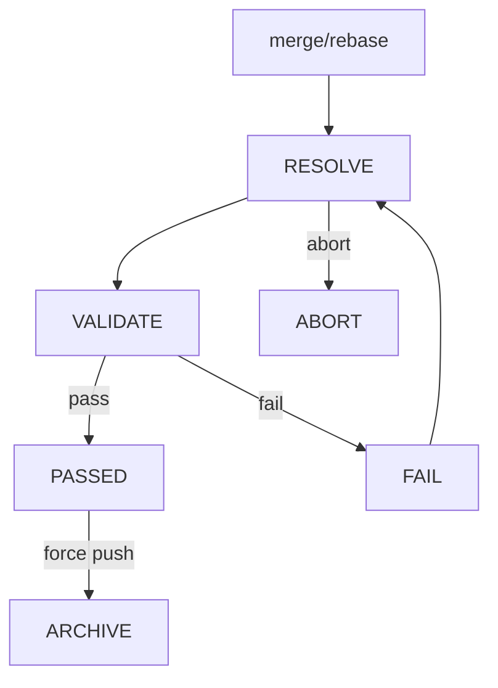

# Action: Merge/Rebase



When resolving conflicts from a merge or rebase, follow these steps:

## 1. Start the operation

Determine the operation type (merge or rebase) and the target branch from the user's request.

- **Merge:** `git merge --no-commit <target-branch>`
- **Rebase:** `git rebase <target-branch>`

If the operation completes cleanly with no conflicts, inform the user and stop.

Create a task under `.tequila/tasks/{task-id}/`:
- Task id: `{next-id}-merge-<branch>` or `{next-id}-rebase-onto-<branch>`
- `state`: `RESOLVING`
- `proposal.md`: auto-generated, stating the operation type, source branch, target branch, and reason if provided.

List conflicting files:

```
git diff --name-only --diff-filter=U
```

For each conflicting file, create a subtask under `subtasks/`:
- Named `{index}-resolve-{filename-kebab}` (e.g., `001-resolve-src-auth-service-py`).
- `commit_message`: draft describing which file is conflicted and what the two sides changed.

Create `subtasks.md` listing all conflicts.

**Merge** produces all conflicts at once — all subtasks are created in this step.

**Rebase** produces conflicts one commit at a time. Enumerate only the conflicts from the current stop. Later stops may append more subtasks (see Step 2).

## 2. Resolve conflicts

For each subtask (conflicting file):

1. **Present the conflict context:**
   - The conflict markers in the file (`<<<<<<<`, `=======`, `>>>>>>>`)
   - What "ours" changed relative to the merge base
   - What "theirs" changed relative to the merge base
2. **Resolve the conflict** based on the user's guidance, or propose a resolution for the user to review.
3. **Save the patch** — diff from the conflicted file (with markers) to the resolved file, saved as `patch` in the subtask directory.
4. **Review** — the user reviews the patch and approves or rejects:
   - If approved: `git add <file>`, set subtask `state` to `APPROVED`, mark complete in `subtasks.md`.
   - If rejected: re-resolve based on feedback, stay on this subtask.
5. Move to the next conflict.

**Rebase only:** After all conflicts in the current stop are resolved, run `git rebase --continue`. If new conflicts arise, go back to Step 1 to enumerate and append new subtasks, then continue resolving.

## 3. Complete the operation

Once all conflicts are resolved:

- **Merge:** `git commit` (using the default merge commit message, or as directed by the user).
- **Rebase:** the final `git rebase --continue` completes the operation.

## 4. Validate

Update the task state to `VALIDATING`.

Follow [VALIDATE-TASK.md](./VALIDATE-TASK.md) to validate the result (e.g., build passes, tests pass, no regressions). On pass, VALIDATE-TASK sets the task state to `PASSED`.

- If validation passes (state `PASSED`), summarize all resolutions and ask the user whether they want to force push the result. If the user agrees, force push and update the task state to `ARCHIVED`. If the user declines, leave the task in `PASSED`.
- If validation fails, follow [DOCUMENT-ISSUES.md](./DOCUMENT-ISSUES.md) to document the issues and update the task state to `FAILED`. Once resolved, the task can be moved back to `RESOLVING` for retry.

## Abort

If the user wants to abandon the operation at any point:

- **Merge:** `git merge --abort`
- **Rebase:** `git rebase --abort`

Update the task state to `ABORTED`. The task and its subtasks remain as a record of partial progress.
